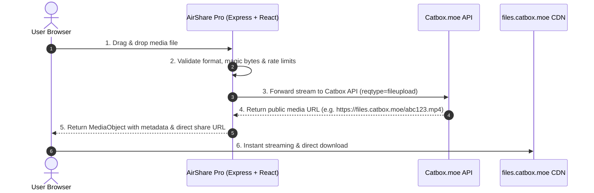

# AirShare Pro

> High-performance instant media sharing, streaming, and management platform powered by Catbox storage and the Clean Glass design system.

---

## Overview

**AirShare Pro** is a modern, responsive web application engineered for instant sharing, streaming, and organization of photos, videos, and audio files without speed throttling. It bridges the gap between high-capacity external storage providers and a polished, desktop-grade user experience with real-time audio visualizers, custom video controls, and flexible media library management.

---

## Key Features

- **Multi-Format Media Uploads**: Support for images (JPEG, PNG, WebP, GIF, SVG), video (MP4, WebM, MOV, MKV), and audio (MP3, WAV, FLAC, OGG, M4A) up to 200MB per file.
- **Real-Time Upload Progress**: Transparent progress tracking with calculated transfer speeds, estimated time remaining, and cancellable transfers via `AbortController`.
- **Clipboard Paste-to-Upload**: Direct `Ctrl+V` / `Cmd+V` paste-to-upload for images and media buffers from anywhere in the application.
- **QR Code Sharing**: Dynamic QR code generation with high-resolution image copying, PNG downloading, and instant smartphone scanning.
- **Dynamic Share Landing Page**: Server-side rendered public preview page (`/s/:id`) featuring tailored Open Graph and Twitter Card metadata for rich social previews.
- **PWA & Offline Capability**: Progressive Web App with offline-capable app shell, real-time connectivity status toasts, and customizable install prompt.
- **Integrated Rich Players**:
  - **HTML5 Video Player**: Custom scrubber, volume sliders, picture-in-picture, fullscreen toggle, double-tap seek, and keyboard shortcuts.
  - **Dynamic Audio Player**: Animated waveform visualizer for visual feedback during playback, automatic ID3 metadata extraction (artist, title, album, embedded artwork), and custom playback controls.
  - **Image Lightbox**: Smooth zooming, aspect ratio retention, rotation controls, and fullscreen view.
- **Media Library & Management**:
  - **Grid & List Views**: Responsive grid for visual media and dense list view for metadata inspection.
  - **Debounced Search**: Fast search across file names, audio track titles, and artist names.
  - **Filter & Sort**: Filter by category (*All*, *Photo*, *Video*, *Audio*) and sort by *Date*, *Name (A-Z)*, or *File Size*.
  - **Multi-Select & Bulk Actions**: Select multiple files for bulk URL copying, native mobile sharing (`navigator.share`), and batch removal.
- **Clean Glass Design**: Apple-inspired aesthetics with refined translucent surfaces, responsive touch targets, dark/light adaptive theming, and zero visual clutter.
- **Defense-in-Depth Security**:
  - Session-scoped anonymous privacy model via `httpOnly`, `Secure`, `SameSite=Strict` cookies.
  - Binary magic bytes validation preventing disguised executables and malicious archives.
  - Strict filename sanitization blocking directory traversal and null byte injections.
  - Sliding-window IP rate limiting with distributed Upstash Redis backend and local in-memory fallback.
  - Hardened Content-Security-Policy (CSP) headers.
  - Zero server secret leakage to client-side bundles.

---

## How It Works



---

## Tech Stack

| Domain | Technology | Description |
| --- | --- | --- |
| **Frontend** | React 19, TypeScript | Declarative UI components and state management |
| **Styling** | Tailwind CSS v4, Motion | Clean Glass design system, hardware-accelerated animations |
| **Backend** | Express 4, Node.js (v20) | REST API endpoints, streaming proxy, security middleware |
| **Build Tooling** | Vite 6, esbuild | Instant development compilation and optimized CJS server bundle |
| **PWA & Offline** | vite-plugin-pwa, Workbox | Offline app shell caching, Web App Manifest, install prompt |
| **Distributed Cache** | Upstash Redis | Multi-tenant session state and atomic sliding-window rate limiting |
| **Storage** | Catbox.moe API | High-capacity, unthrottled media hosting provider |
| **Icons** | Lucide React | Consistent, accessible iconography |

---

## PWA & Offline Support

AirShare Pro is fully compliant as a Progressive Web App (PWA), engineered using `vite-plugin-pwa`:

- **Offline App Shell**: All core application UI assets, styles, and vector icons are cached in the browser via a Service Worker (`generateSW`), allowing the application interface to load instantly even when offline.
- **Online-First Network Strategy**: Dynamic API endpoints (`/api/*`) and SSR share landing routes (`/s/*`) enforce a `NetworkOnly` strategy (with `navigateFallbackDenylist`), ensuring real-time integrity and avoiding stale media state or broken offline SPA fallbacks.
- **Connection Status Toasts**: Real-time network listeners alert users with responsive toasts when internet connectivity is lost or restored.
- **Custom In-App Install Prompt**: Native PWA installation modal and header shortcut ("Pasang Aplikasi") allowing seamless one-click installation to the desktop or mobile home screen.

---

## System Architecture

AirShare Pro features a dual-entrypoint architecture sharing a single, robust Express application and API core:

```
                    AirShare Pro
                         │
              ┌──────────┴──────────┐
              │                     │
        Development             Production
              │                     │
          server.ts               Vercel
              │                     │
           Express             api/index.js
              │              (Vercel Function)
         app.listen()               │
              │                     │
              └──────────┬──────────┘
                         │
                  Express App Core
                 (src/server/app.ts)
                         │
              ┌──────────┴──────────┐
              ▼                     ▼
       Security & CSP          API Router
        Rate Limiter         (/api, /s/:id)
              │                     │
              │              ┌──────┴──────┐
              ▼              ▼             ▼
       ┌─────────────┐ Media Controller  Media Repo
       │Upstash Redis│       │             ▲
       │ (Prod State)│───────┼─────────────┘
       └─────────────┘       ▼
        (Fallback to  StorageProvider ──► Catbox API
         In-Memory)  (Catbox Provider)   (Upstream)
```

- **Local Development**: `server.ts` imports the shared Express app, attaches Vite dev middleware for Hot Module Replacement / asset serving, and binds `app.listen(3000)`.
- **Production (Vercel Serverless)**: `src/server/vercel.ts` compiles to `api/index.js` and exports the Express app as a Vercel Serverless Function without executing `app.listen()`. `vercel.json` routes `/api/(.*)` and `/s/(.*)` directly to this entrypoint.
- **State & Rate Limiting**: Upstash Redis powers distributed sliding-window rate limiting and session-scoped metadata storage in production. An in-memory rate-limiter and repository act as automatic zero-config fallbacks for local development when Upstash credentials are not set.

For comprehensive architectural specifications, refer to [docs/architecture.md](docs/architecture.md).

---

## Getting Started

### Prerequisites
- Node.js 20.x or later
- npm 9.x or later

### Installation & Local Run

```bash
# 1. Clone the repository
git clone https://github.com/aryaxzell/Airshare-Pro.git
cd Airshare-Pro

# 2. Install dependencies
npm install

# 3. Configure environment variables
cp .env.example .env

# 4. Launch development server
npm run dev
```

Open [http://localhost:3000](http://localhost:3000) in your browser.

---

## Available Scripts

| Script | Command | Purpose |
| --- | --- | --- |
| `npm run dev` | `tsx server.ts` | Launches Express server with Vite in development mode |
| `npm run build` | `vite build && esbuild server.ts ...` | Compiles client and bundles standalone server to `dist/server.cjs` |
| `npm run start` | `node dist/server.cjs` | Runs the compiled standalone server in production |
| `npm run typecheck` | `tsc --noEmit` | Validates TypeScript types across the entire project |
| `npm run lint` | `tsc --noEmit` | Codebase type and syntax validation |
| `npm run test` | `tsx src/server/__tests__/security.test.ts` | Runs the security, sanitization, and rate limiter test suite |
| `npm run clean` | `rm -rf dist server.js` | Removes build outputs and artifacts |

---

## Environment Variables

All configuration is managed via standard environment variables:

| Variable | Type | Default | Description |
| --- | --- | --- | --- |
| `CATBOX_USERHASH` | Optional | `""` | Userhash from Catbox.moe for account-linked storage & file deletion. |
| `MAX_UPLOAD_SIZE` | Optional | `209715200` | Maximum file size in bytes (200MB). |
| `CATBOX_TIMEOUT_MS` | Optional | `60000` | Timeout for Catbox upstream HTTP requests in ms. |
| `RATE_LIMIT_MAX_UPLOADS_PER_MIN` | Optional | `20` | Max uploads allowed per IP per minute. |
| `UPSTASH_REDIS_REST_URL` | Optional | `""` | Upstash Redis REST URL. Optional for local development; required for reliable multi-instance production state. |
| `UPSTASH_REDIS_REST_TOKEN` | Optional | `""` | Upstash Redis REST Token. Optional for local development; required for reliable multi-instance production state. |
| `NODE_ENV` | Optional | `development` | Application mode (`development` / `production`). |
| `PORT` | Optional | `3000` | Server listen port. |

See [.env.example](.env.example) for a pre-formatted template.

---

## API Overview

AirShare Pro provides a REST API under `/api/media` along with dynamic share routes:

- `GET /api/media/config`: Get server upload limits and provider capabilities.
- `POST /api/media/upload`: Multipart upload for images, videos, and audio.
- `GET /api/media`: List recorded media items in the caller's session-scoped repository.
- `GET /api/media/:id`: Retrieve details for a single media item owned by caller's session.
- `DELETE /api/media/:id`: Delete a media item from session repository (and from Catbox if `CATBOX_USERHASH` is set).
- `DELETE /api/media`: Clear session-scoped repository media history.
- `GET /s/:id`: Public share landing page with dynamic Open Graph and Twitter Card preview per media type.
- `GET /api/health`: Service health check and provider status.

For full payload contracts and status codes, see [docs/api.md](docs/api.md).

---

## Storage & Catbox Integration

- **Public URLs**: Files uploaded to Catbox are hosted publicly on `https://files.catbox.moe/<id>`. Media URLs are public by design.
- **Deletion Capabilities**: Catbox only permits API-driven deletion when files are uploaded with a valid `CATBOX_USERHASH`. Anonymous uploads cannot be deleted from Catbox via API and are cleared only from the caller's session-scoped repository on the server.
- **Provider Abstraction**: Storage interactions implement the `StorageProvider` interface, decoupling the application core from Catbox-specific logic.

---

## Limitations & Known Operational Constraints

1. **Catbox Server-Side Deletion**: Without `CATBOX_USERHASH`, files uploaded to Catbox cannot be purged from Catbox servers via API; deleting in the app removes the entry from the session-scoped repository on the server only.
2. **Session-Scoped Persistence & Redis**: Media metadata is stored in Upstash Redis in production, scoped strictly to each visitor's anonymous session via secure HTTP-only cookies. Client-side `localStorage` acts only as a temporary visual cache for optimistic UI rendering, not the authoritative source of truth. If running without Upstash Redis configured, the server falls back to an in-memory repository that resets upon serverless cold starts.
3. **Serverless Payload Limits**: Vercel Serverless Functions configure `bodyParser: false` in `src/server/vercel.ts` (bundled to `api/index.js`), allowing Multer to ingest raw multipart streams directly without default Vercel body parser truncation. Combined with `maxDuration: 60` in `vercel.json`, large media uploads operate reliably within the configured `MAX_UPLOAD_SIZE`.
4. **Public Accessibility**: Catbox media URLs are directly accessible over the public internet to anyone holding the direct link. Media uploaded to Catbox is not encrypted at rest or password-protected.

---

## AI Integration Roadmap (`@google/genai`)

The project includes `@google/genai` in `package.json` and declares `MAJOR_CAPABILITY_SERVER_SIDE_GEMINI_API` in `metadata.json` in preparation for server-side AI media capabilities:
- **Intelligent Auto-Tagging**: Automated categorization of uploaded photography, video, and audio files.
- **Contextual Media Descriptions**: AI-generated descriptive summaries and audio transcription.
- **Security & Content Safety**: Heuristic validation and classification on server-side media proxy streams.

All Gemini API calls will run exclusively on the server layer using `process.env.GEMINI_API_KEY`, keeping client bundles light and credentials secure. For technical details, see [docs/roadmap.md](docs/roadmap.md).

---

## Project Status

- :white_check_mark: **Real Catbox Storage Integration**: Fully operational.
- :white_check_mark: **Media Library & Management**: Fully operational.
- :white_check_mark: **Rich Audio/Video Players & Visualizer**: Fully operational.
- :white_check_mark: **Security & Rate Limiting Hardening**: Fully operational.
- :white_check_mark: **Session-Scoped Anonymous Privacy**: Fully operational.
- :white_check_mark: **Progressive Web App (PWA) & Offline Shell**: Fully operational.
- :white_check_mark: **QR Code Generation & Copy/Download**: Fully operational.
- :white_check_mark: **Dynamic Share Landing Page (`/s/:id`)**: Fully operational.
- :white_check_mark: **CI/CD & Repository Infrastructure**: Fully operational.
- :hourglass_flowing_sand: **AI Enhancements (`@google/genai`)**: Prepared in dependency & architecture roadmap.

---

## Documentation Directory

- [Architecture Guide](docs/architecture.md)
- [API Reference](docs/api.md)
- [Development Workflow](docs/development.md)
- [Deployment Guide](docs/deployment.md)
- [Feature & AI Roadmap](docs/roadmap.md)

---

## License

AirShare Pro is proprietary software.

Copyright (c) 2026 AryaXzell. All rights reserved.

See [LICENSE](LICENSE) for details.
