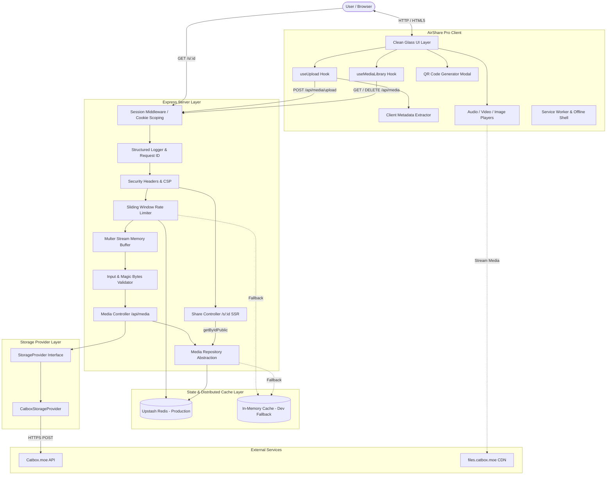

# AirShare Pro Architecture Documentation

## Overview

AirShare Pro is an instant, high-performance media sharing, streaming, and management platform built with React 19, TypeScript, Express, and Vite. Storage persistence is powered by upstream provider **Catbox.moe** via an extensible `StorageProvider` abstraction layer.

---

## 1. High-Level System Architecture



> **Note on State Persistence**: Upstash Redis is automatically utilized for rate limiting and session-scoped metadata storage whenever `UPSTASH_REDIS_REST_URL` and `UPSTASH_REDIS_REST_TOKEN` are configured. If unconfigured (such as during local development), the server automatically falls back to bounded in-memory storage.

---

## 2. Component Layers

### 2.1 Frontend Layer (Client-Side)
- **Framework**: React 19 with TypeScript.
- **Styling**: Tailwind CSS v4 featuring the **Clean Glass** design system, high-contrast typography (Plus Jakarta Sans & JetBrains Mono), and dark/light adaptive theming.
- **Progressive Web App (PWA)**: Built with `vite-plugin-pwa` and Workbox, providing an offline-capable app shell, dynamic network status banners, and native install prompt.
- **Client Metadata Extraction**: `mediaMetadata.ts` extracts video aspect ratios, image dimensions, and audio ID3 metadata (artist, title, album, embedded APIC album art) prior to or during upload.
- **Media Library Synchronization**: Multi-layer state management combining server repository data with optimistic client-side caching for instant UI updates and offline awareness.

### 2.2 Dual-Entrypoint Server Architecture (Express + Vercel Serverless)

AirShare Pro cleanly decouples the Express application factory from the runtime runner:

- **Express Application Factory (`src/server/app.ts`)**:
  - Initializes Express instance, parses session cookies, and attaches `sessionMiddleware`.
  - Attaches structured request logging and `X-Request-Id` tracking.
  - Mounts security headers (CSP, nosniff, Referrer-Policy) and sliding-window rate limiters.
  - Mounts SSR share landing controller (`GET /s/:id`).
  - Registers the media API router under both `/api/media` and `/media`.
  - Implements uniform structured JSON 404 handler and central error middleware.
  - **Does NOT call `app.listen()`**, making it purely exportable and reusable.

- **Local Development Runner (`server.ts`)**:
  - Imports `createExpressApp()` from `src/server/app.ts`.
  - Integrates Vite development middleware for instant HMR in development (`NODE_ENV !== 'production'`) or static asset serving in standalone production.
  - Binds persistent listener via `app.listen(3000, '0.0.0.0')`.

- **Vercel Serverless Build Entrypoint (`src/server/vercel.ts` -> `api/index.js`)**:
  - Acts as the serverless entrypoint for Vercel Functions.
  - Bundled via `esbuild` to `api/index.js` during `npm run build`.
  - Configures `export const config = { api: { bodyParser: false } }` to ensure raw multipart streams pass directly to Multer without upstream buffer truncation.
  - Monitored by `vercel.json` with `maxDuration: 60`, routing `/api/(.*)` and `/s/(.*)` directly to this serverless handler.

### 2.3 Session-Scoped Anonymous Privacy Middleware

AirShare Pro implements strict multi-tenant data isolation for anonymous users (`src/server/security/session.ts`):
- **Cookie Mechanics**: Every visitor is assigned an `airshare_session` cookie containing a cryptographically random UUID (`sess_<hex>`). The cookie is marked `httpOnly: true`, `secure: process.env.NODE_ENV === 'production'`, `sameSite: 'strict'`, with 1-year max age.
- **Pipeline Position**: `sessionMiddleware` runs immediately after `cookieParser` at the entry of the request lifecycle, ensuring all downstream loggers, limiters, and controllers have access to `req.sessionId`.
- **Query Scoping**: Media items are partitioned strictly by `sessionId`. Users can only query, list, or delete items associated with their current session.

### 2.4 Public Share Controller (`/s/:id`)

The Share Controller (`src/server/api/share-controller.ts`) powers dynamic public links:
- **Server-Side Rendered (SSR) Previews**: Responds to `GET /s/:id` by querying `repo.getByIdPublic(id)`.
- **Open Graph & Twitter Cards**: Injects context-aware meta tags (`og:title`, `og:image`, `og:video`, `og:audio`, `twitter:card`) so shared links display rich visual cards on Discord, WhatsApp, Telegram, iMessage, and Twitter/X.
- **Sanitized Projection (`PublicMediaView`)**: Public queries return only display-safe attributes (media URL, filename, format, size, dimensions), strictly omitting owner `sessionId` values.

### 2.5 Storage Provider Abstraction
```typescript
export interface StorageProvider {
  readonly name: string;
  isDeleteSupported(): boolean;
  upload(fileBuffer: Buffer | Uint8Array | Blob, filename: string, mimeType: string): Promise<StorageUploadResult>;
  delete(idOrUrl: string): Promise<StorageDeleteResult>;
}
```
- **Provider Decoupling**: The core controller interacts strictly with the `StorageProvider` interface rather than hardcoding Catbox endpoints. This allows future storage drivers (e.g. S3, Cloudflare R2) to be added with zero changes to business logic.
- **Catbox Implementation (`CatboxStorageProvider`)**:
  - Implements multipart upload to `https://catbox.moe/user/api.php` (`reqtype=fileupload`).
  - Supports exponential backoff (retries transient 5xx/network errors, halts immediately on 4xx).
  - Employs `AbortController` timeouts (`CATBOX_TIMEOUT_MS`).
  - Catbox file deletion (`reqtype=deletefiles`) is executed if `CATBOX_USERHASH` is configured on the server.
  - Automatically scrubs credentials from error output.

### 2.6 Media Repository & State Layer
- **Interface (`MediaRepository`)**: Defines CRUD contracts (`create`, `list`, `get`, `delete`, `clearAll`, `getByIdPublic`).
- **Production Upstash Repository (`UpstashMediaRepository`)**:
  - Backed by Upstash Redis REST API.
  - Stores user metadata lists under `session:<sessionId>:media` and public lookups under `public:media:<id>`.
  - Atomic pipeline execution prevents race conditions and data corruption across serverless invocations.
- **Development Repository (`DevelopmentMediaRepository`)**:
  - In-memory FIFO cache with memory bounding (150 items max) to ensure zero memory leaks during long-running sessions.
- **Dynamic Factory (`getMediaRepository()`)**: Evaluates `isUpstashConfigured()` on request, seamlessly returning the Redis repository if environment variables are present or falling back to development memory.

---

## 3. End-to-End Upload Lifecycle

1. **User Selection**: User drags or picks a photo, video, or audio file in `UploadZone.tsx`, or pastes from the clipboard.
2. **Client Validation**: File type and size are inspected on the client for immediate visual feedback.
3. **Multipart Request**: The `useUpload` hook streams the file payload via `XMLHttpRequest` to track upload progress smoothly.
4. **Server Ingestion**: Multer buffers the file in memory.
5. **Security Gate**:
   - `input-validator.ts` checks banned extensions and validates binary magic bytes.
   - `rate-limiter.ts` verifies client IP quota (via Redis or in-memory sliding window).
6. **Upstream Forwarding**: `CatboxStorageProvider` streams the buffer to Catbox with timeout protection.
7. **Storage Response**: Catbox returns the public media URL (e.g. `https://files.catbox.moe/xyz123.mp4`).
8. **Metadata Record**: Server records the `MediaObject` scoped to `req.sessionId` in `MediaRepository` and indexes the public view.
9. **UI Display**: Client adds the item to the reactive `MediaLibrary` state and presents instant sharing, playback, QR generation, and copy actions.

---

*Copyright (c) 2026 AryaXzell. All rights reserved.*
