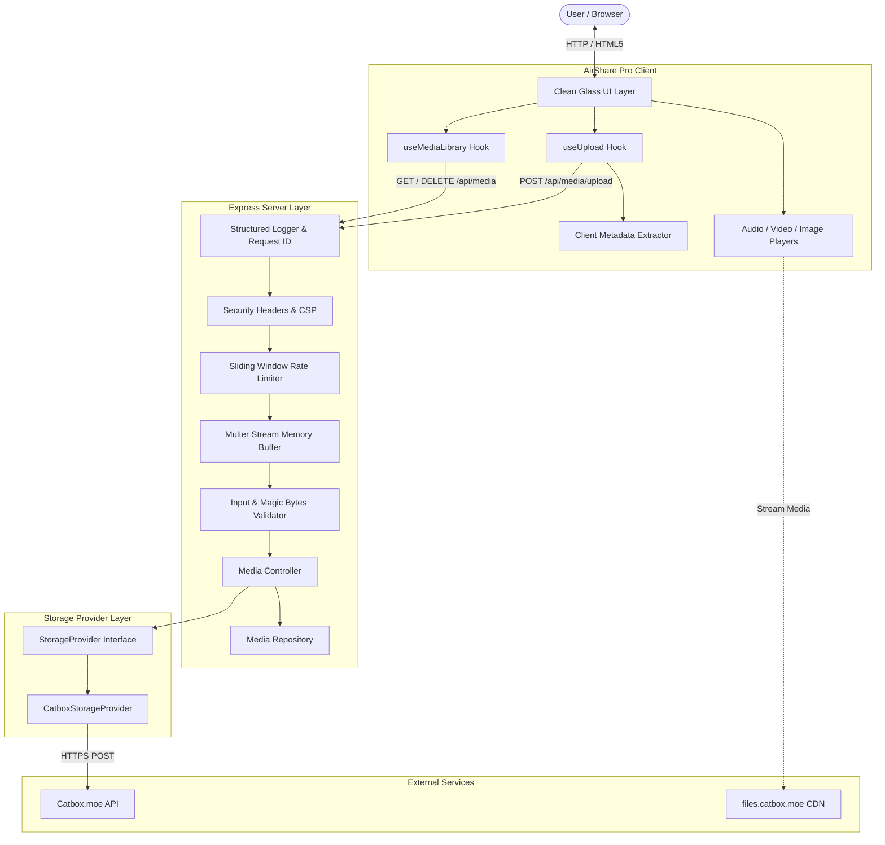

# AirShare Pro Architecture Documentation

## Overview

AirShare Pro is an instant, high-performance media sharing, streaming, and management platform built with React 19, TypeScript, Express, and Vite. Storage persistence is powered by upstream provider **Catbox.moe** via an extensible `StorageProvider` abstraction layer.

---

## 1. High-Level System Architecture



---

## 2. Component Layers

### 2.1 Frontend Layer (Client-Side)
- **Framework**: React 19 with TypeScript.
- **Styling**: Tailwind CSS v4 featuring the **Clean Glass** design system, high-contrast typography (Plus Jakarta Sans & JetBrains Mono), and dark/light adaptive theming.
- **Client Metadata Extraction**: `mediaMetadata.ts` extracts video aspect ratios, image dimensions, and audio ID3 metadata (artist, title, album, embedded APIC album art) prior to or during upload.
- **Media Library Synchronization**: Multi-layer state management combining server repository data with local client caching for offline resilience and immediate UI updates.

### 2.2 Dual-Entrypoint Server Architecture (Express + Vercel Serverless)

AirShare Pro cleanly decouples the Express application factory from the runtime runner:

- **Express Application Factory (`src/server/app.ts`)**:
  - Initializes Express instance, attaches structured request logging and `X-Request-Id` tracking.
  - Mounts security headers (CSP, nosniff, Referrer-Policy) and sliding-window rate limiters.
  - Registers the media API router under both `/api/media` and `/media`.
  - Implements uniform structured JSON 404 handler and central error middleware.
  - **Does NOT call `app.listen()`**, making it purely exportable and reusable.

- **Local Development Runner (`server.ts`)**:
  - Imports `createExpressApp()` from `src/server/app.ts`.
  - Integrates Vite development middleware for instant HMR in development (`NODE_ENV !== 'production'`) or static asset serving in standalone production.
  - Binds persistent listener via `app.listen(3000, '0.0.0.0')`.

- **Vercel Serverless Adapter (`api/index.ts`)**:
  - Acts as the serverless entrypoint for Vercel Functions.
  - Imports `app` from `src/server/app.ts` and exports a lightweight handler wrapping the Express application.
  - Configures `export const config = { api: { bodyParser: false } }` to ensure raw multipart streams pass directly to Multer without upstream buffer truncation.
  - Routes matching `/api/(.*)` are mapped to this handler via `vercel.json`.

### 2.3 Storage Provider Abstraction
```typescript
export interface StorageProvider {
  readonly name: string;
  isDeleteSupported(): boolean;
  upload(fileBuffer: Buffer | Uint8Array | Blob, filename: string, mimeType: string): Promise<StorageUploadResult>;
  delete(idOrUrl: string): Promise<StorageDeleteResult>;
}
```
- **Provider Decoupling**: The core controller interacts strictly with the `StorageProvider` interface rather than hardcoding Catbox endpoints. This allows future storage drivers (e.g. S3, Cloudflare R2) to be added with zero changes to business logic.
- **Catbox Implementation (`CatboxStorageProvider`)**:
  - Implements multipart upload to `https://catbox.moe/user/api.php` (`reqtype=fileupload`).
  - Supports exponential backoff (retries transient 5xx/network errors, halts immediately on 4xx).
  - Employs `AbortController` timeouts (`CATBOX_TIMEOUT_MS`).
  - Catbox file deletion (`reqtype=deletefiles`) is executed if `CATBOX_USERHASH` is configured on the server.
  - Automatically scrubs credentials from error output.

### 2.4 Media Repository Layer
- **Interface (`MediaRepository`)**: Defines CRUD contracts (`create`, `list`, `get`, `delete`, `clearAll`).
- **Development Repository (`DevelopmentMediaRepository`)**: In-memory FIFO cache with memory bounding (150 items max) to ensure zero memory leaks during long-running sessions.

---

## 3. End-to-End Upload Lifecycle

1. **User Selection**: User drags or picks a photo, video, or audio file in `UploadZone.tsx`.
2. **Client Validation**: File type and size are inspected on the client for immediate visual feedback.
3. **Multipart Request**: `uploadService.ts` streams the file payload via `XMLHttpRequest` to track upload progress smoothly.
4. **Server Ingestion**: Multer buffers the file in memory.
5. **Security Gate**:
   - `input-validator.ts` checks banned extensions and validates binary magic bytes.
   - `rate-limiter.ts` verifies client IP quota.
6. **Upstream Forwarding**: `CatboxStorageProvider` streams the buffer to Catbox with timeout protection.
7. **Storage Response**: Catbox returns the public media URL (e.g. `https://files.catbox.moe/xyz123.mp4`).
8. **Metadata Record**: Server instantiates a `MediaObject`, records it in the repository, and returns a 201 JSON payload.
9. **UI Display**: Client adds the item to the reactive `MediaLibrary` state and presents instant sharing, playback, and copy actions.

---

*Copyright (c) 2026 AryaXzell. All rights reserved.*
